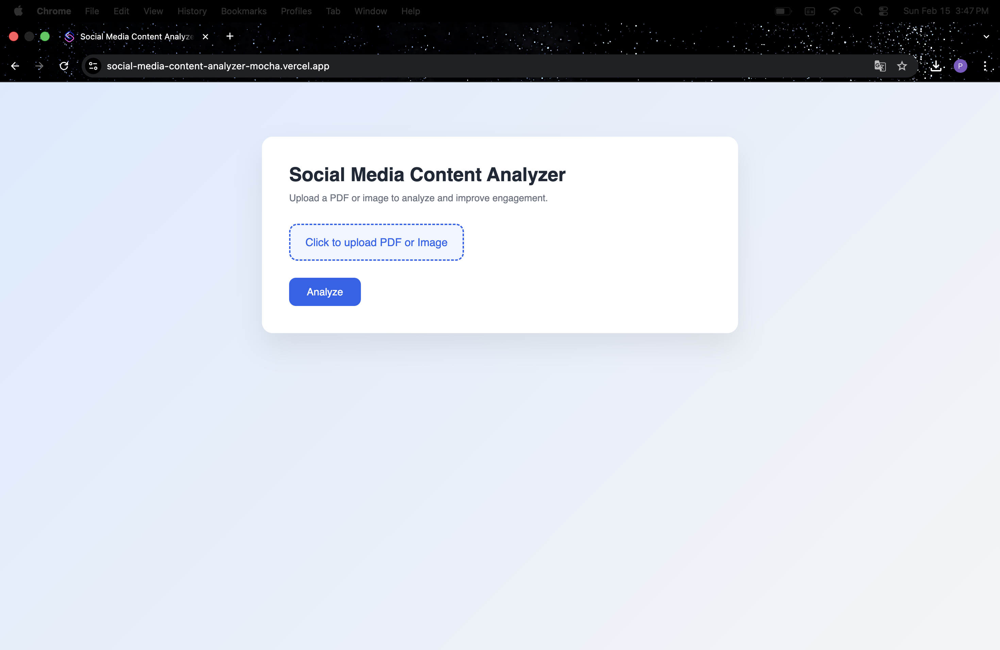
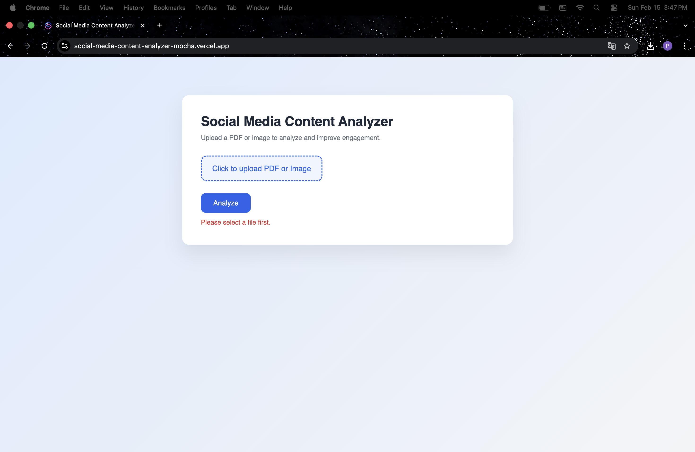
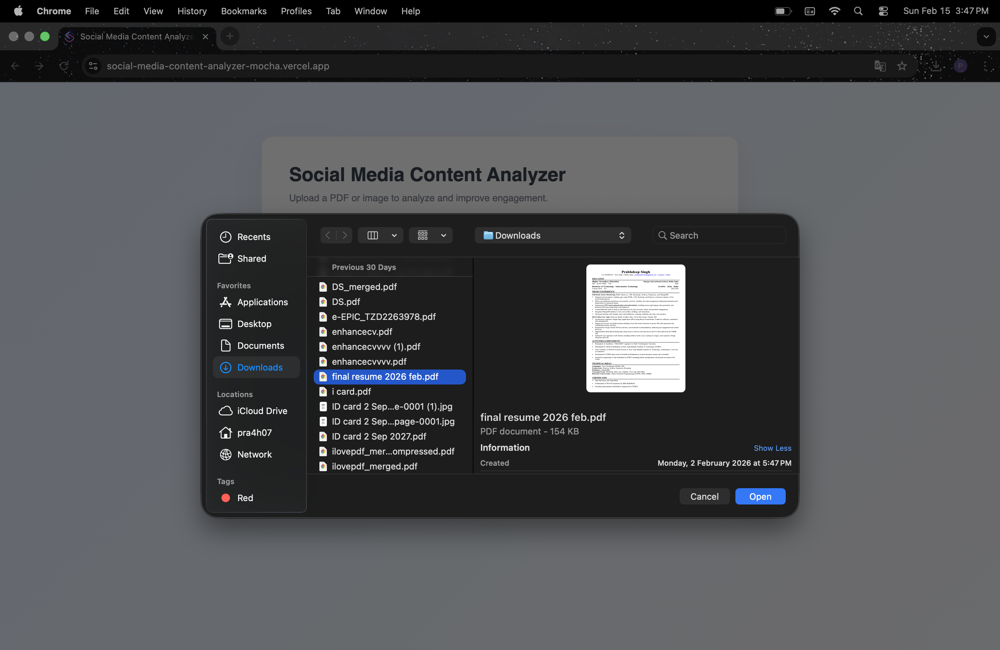
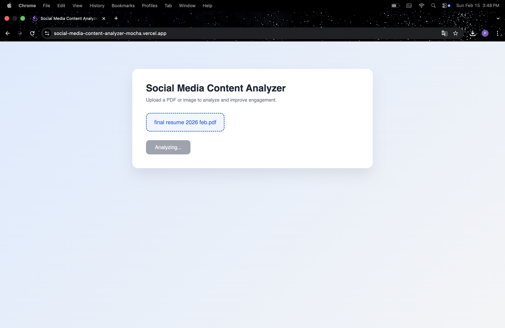
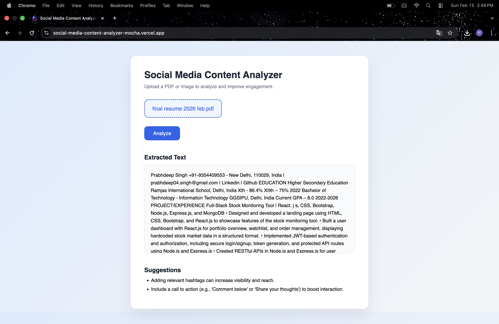
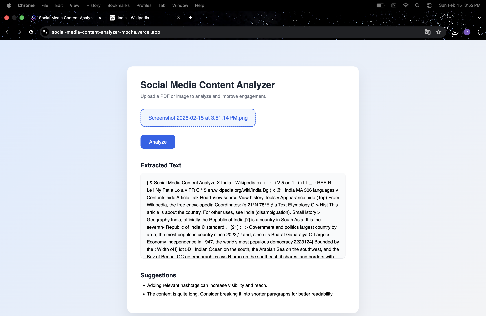
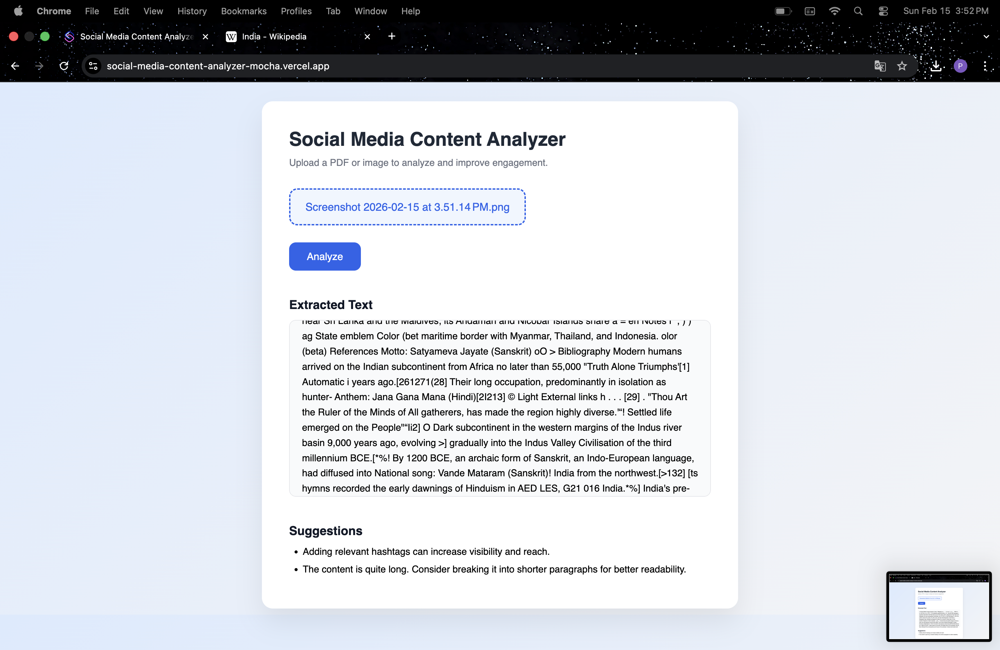
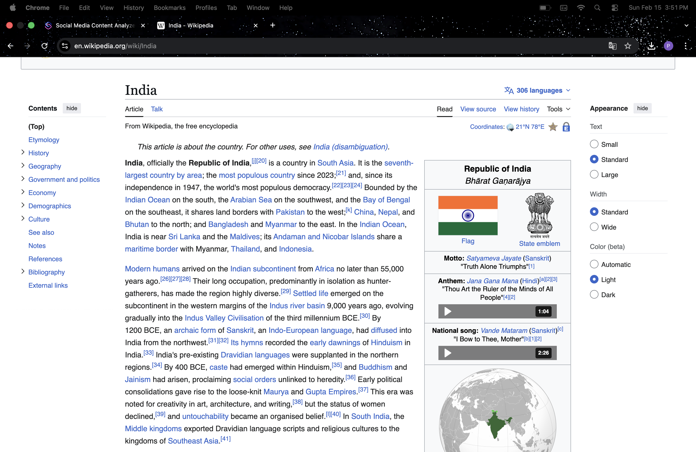
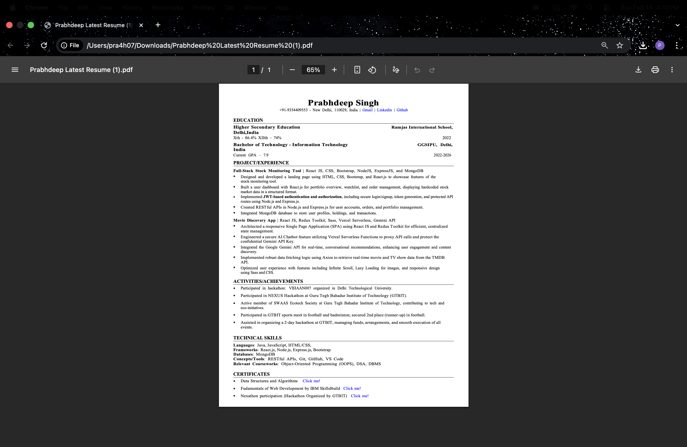

# Documentation

## Brief Write-Up of Approach

I structured the project using a simple client-server architecture so that the frontend and backend responsibilities are clearly separated. The frontend handles file uploads and displays the extracted text and suggestions, while the backend processes the file and performs the analysis.

On the backend, I used Express.js and Multer to handle file uploads using memory storage. After receiving the file, I check its type. If it is a PDF, I extract text using `pdf-parse`. If it is an image, I use `tesseract.js` to perform OCR and convert the image into readable text.

Once the text is extracted, I implemented a basic rule-based logic to analyze the content. The system checks the word count, presence of hashtags, and common call-to-action phrases. Based on these conditions, relevant suggestions are generated and returned to the frontend.

The application was tested using publicly available documents such as resumes and notices. Finally, the project was deployed using Render for the backend and Vercel for the frontend.

---

# Test Data Used (Public Sources)

1. Wikipedia Article – India  
   https://en.wikipedia.org/wiki/India

2. Sample Resume PDF (Personal Test File)

---

# Sample Outputs

## Output 1

## Output 2

## Output 3

## Output 4

## Output 5

## Output 6

## Output 7

## Wikipedia Test Output

## Pdf Test Output
